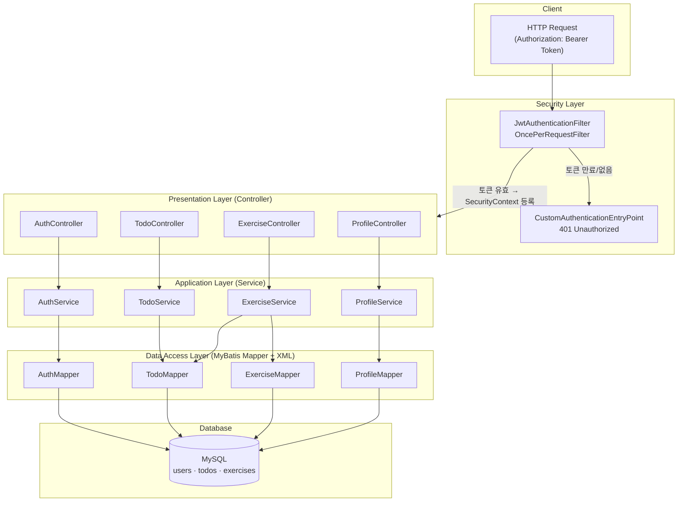
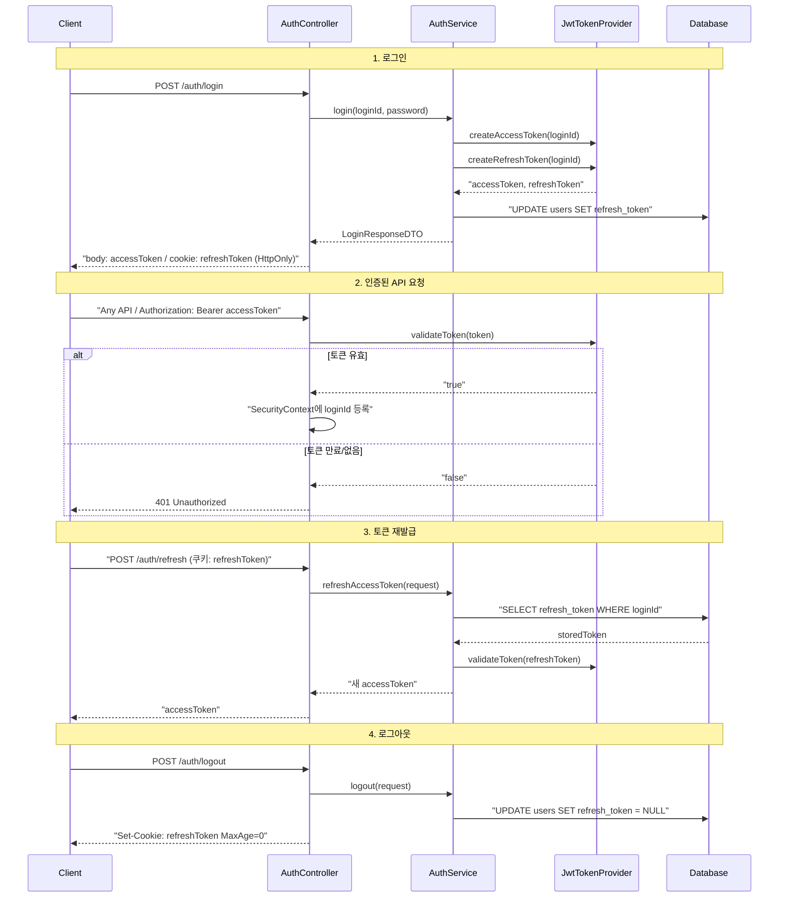
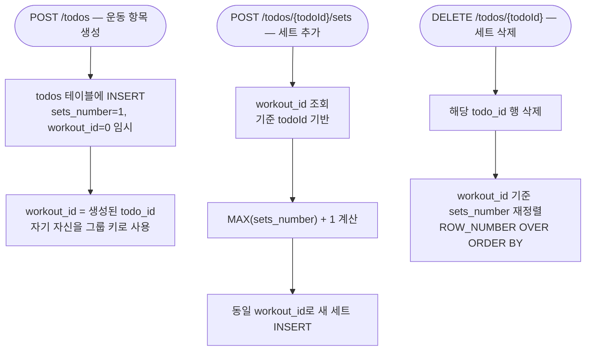
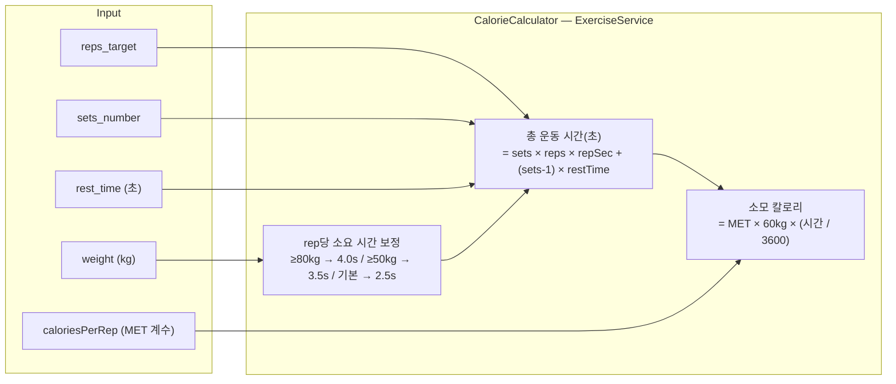
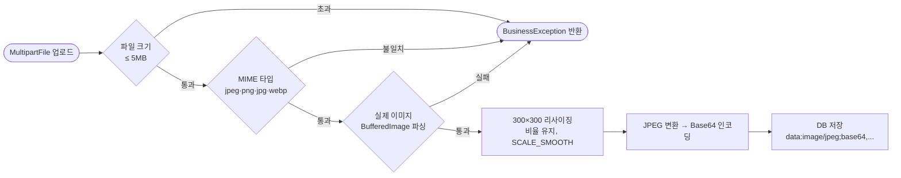

# FitLog - Backend


운동 기록 및 투두 관리 REST API 서버입니다.  
Spring Boot + MyBatis + MySQL 기반으로 구축되었으며, JWT 인증 체계와 Spring Security를 활용합니다.

<br/>

---

## Backend Architecture Structure

본 프로젝트의 백엔드는 명확한 계층 분리와 유지보수성을 확보하기 위해 **Layered Architecture** 를 기반으로 설계되었습니다.  
Spring Security + JWT 이중 토큰 전략으로 인증/인가를 처리하며, MyBatis XML Mapper를 통해 SQL을 명시적으로 관리합니다.

### Key Architectural Concepts

**Layered Architecture + Security Filter Chain**

- 각 계층(Presentation → Application → Data Access)이 단방향 의존성을 갖도록 설계하여 관심사를 분리했습니다.
- Spring Security의 **Filter Chain** 을 커스터마이징하여, 모든 요청이 컨트롤러에 도달하기 전 JWT 검증을 수행합니다.
- `SecurityUtil` 유틸리티를 통해 서비스 계층 어디서든 현재 인증된 사용자 정보를 꺼낼 수 있습니다.



<br/>

---

**JWT 이중 토큰 전략 (Access Token + Refresh Token)**

보안성과 사용자 경험을 동시에 확보하기 위해 수명이 다른 두 토큰을 운용합니다.

- **Access Token**: 짧은 수명(1시간)으로 탈취 피해를 최소화. HTTP 응답 body로 전달합니다.
- **Refresh Token**: 긴 수명(7일)으로 재로그인 빈도를 낮춤. `HttpOnly Cookie` 로 전달하여 XSS 공격을 차단합니다.
- Refresh Token은 DB에 저장하여 서버에서 강제 폐기(로그아웃)가 가능합니다.



<br/>

---

**운동 기록 관리 흐름 (Todo Domain)**

`workout_id` 전략으로 세트 그룹을 관리합니다. 운동 항목 생성 시 `todo_id`를 `workout_id`로 사용하며, 이후 추가되는 세트들은 동일한 `workout_id`를 공유합니다.



<br/>

---

**칼로리 계산 전략 (MET 기반)**

단순 횟수 × 계수가 아닌, 실제 운동 시간을 추정하여 보다 정확한 소모 칼로리를 계산합니다.



> 마지막 세트의 휴식시간은 0으로 처리하여 불필요한 시간이 칼로리에 포함되지 않도록 합니다.

<br/>

---

**프로필 이미지 처리 파이프라인**

외부 스토리지 없이 DB에 직접 Base64로 저장하는 방식으로, 별도 인프라 없이 이미지를 관리합니다.



<br/>

---

## 📁 프로젝트 구조

```
src/main/java/com/ureca/fitlog/
├── auth/
│   ├── controller/         AuthController.java
│   ├── service/            AuthService.java
│   ├── mapper/             AuthMapper.java
│   ├── jwt/                JwtTokenProvider.java
│   │                       JwtAuthenticationFilter.java
│   └── dto/                request/ · response/
│
├── todos/
│   ├── controller/         TodoController.java
│   ├── service/            TodoService.java
│   ├── mapper/             TodoMapper.java
│   └── dto/                request/ · response/
│
├── exercise/
│   ├── controller/         ExerciseController.java
│   ├── service/            ExerciseService.java
│   ├── mapper/             ExerciseMapper.java
│   └── dto/                response/
│
├── profile/
│   ├── controller/         ProfileController.java
│   ├── service/            ProfileService.java
│   ├── mapper/             ProfileMapper.java
│   └── dto/                request/ · response/
│
├── common/
│   ├── SecurityUtil.java
│   ├── dto/                ApiMessageResponse.java
│   └── exception/          BusinessException.java
│                           ExceptionStatus.java
│                           GlobalExceptionHandler.java
│
└── config/
    ├── SecurityConfig.java
    ├── CorsConfig.java
    ├── SwaggerConfig.java
    └── CustomAuthenticationEntryPoint.java

src/main/resources/
├── mapper/
│   ├── AuthMapper.xml
│   ├── TodoMapper.xml
│   ├── ExerciseMapper.xml
│   └── ProfileMapper.xml
└── application.yml
```

<br/>

---

## ⚙️ 실행 방법

**1. 사전 조건**

- Java 17+
- MySQL 8.x 실행 중 + `fitlog` 데이터베이스 생성

**2. `application.yml` 설정**

```yaml
spring:
  datasource:
    url: jdbc:mysql://localhost:3306/fitlog
    username: root
    password: your_password

jwt:
  secret: your_secret_key_here   # 최소 32바이트 권장
  access-expiration: 3600000     # 1시간 (ms)
  refresh-expiration: 604800000  # 7일 (ms)
```

> 배포 시 `SecurityConfig` 내 `refreshCookie.setSecure(false)` → `true` 변경 필수

**3. 빌드 및 실행**

```bash
./gradlew bootRun
```

**4. API 문서 (Swagger)**

서버 실행 후 → `http://localhost:8080/swagger-ui`

<br/>

---

## 🔐 API 인증 방법

```
1. POST /auth/login        →  accessToken 수령
2. 모든 요청 헤더에 포함   →  Authorization: Bearer <accessToken>
3. 401 응답 시             →  POST /auth/refresh  →  새 accessToken 수령
                               (HttpOnly 쿠키의 refreshToken 자동 전송)
```

<br/>

---

## 🧑‍💻 팀원

|                  이름                  | 역할               |
| :------------------------------------: | :----------------- |
|  [김주희](https://github.com/joooii)   | PM, FE, BE, Design |
| [박준형](https://github.com/joonhyong) | FE, BE, Design     |
